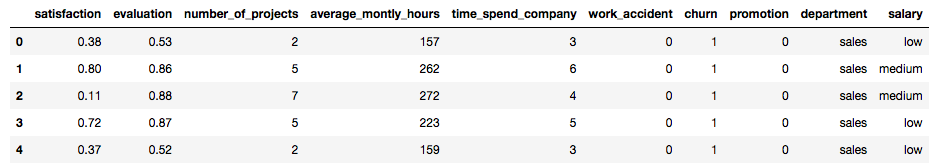
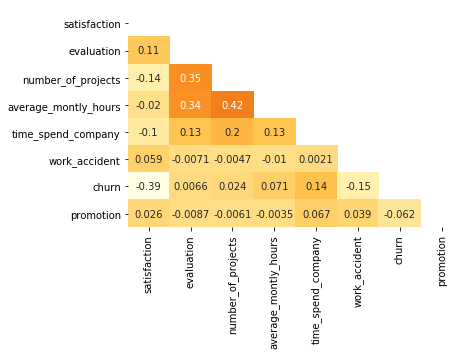

# previsao-rotatividade

Hoje em dia, o termo People Analytics tem ganhado cada vez mais popularidade. Em resumo, people analytics representa um conjunto de técnicas e métodos que são orientados a dados e focados em entender os processos, comportamentos e oportunidades das pessoas dentro das organizações, guiando os times de recursos humanos nas tomadas de decisões.

Vários times de recursos humanos podem se beneficiar desse tipo de análise. Algumas abordagens mais conhecidas são o apoio no processo de seleção de talentos, estudos de performance e remuneração, e a criação de times colaborativos.

Nesse post, vou mostrar um exemplo utilizando python de como os dados podem ajudar a prever a rotatividade dentro da organização. Esse modelo consegue prever quando um funcionário pretende sair da empresa e ajuda o time de atração e seleção a se preparar para que as cadeiras não fiquem vazias! 

**Vamos começar?**

Aqui eu vou mostrar os principais comandos pra gerar os resultados, e mais detalhes do código podem ser vistos no arquivo Estudo-Rotatividade.ipynb.

Começamos então com a leitura da base e uma análise dos atributos que vamos utilizar pra construir o modelo :)

```
dados = pd.read_csv("turnover.csv")
dados.head()
```

A figura abaixo mostra as primeiras linhas da base (que contem informações de 15 mil funcionários diferentes). 



Essa tabela é composta de 10 colunas diferentes:

- satisfaction: um indicador que varia de 0 a 1 e mostra o quão satisfeito o funcionário esta na emprsa.
- evaluation: um indicador da ultima performance do funcionário (varia de 0 a 1).
- number_of_projects: o número de projetos que o funcionário já participou na empresa.
- average_montly_hours: o número médio de horas que o funcionario trabalha mensalmente.
- time_spend_company: o tempo de empresa do colaborador.
- work_accident: indica 0 se o colaborador nunca teve um acidente de trabalho, e 1 caso ele teve.
- promotion: se o funcionário foi promovido nos ultimos cinco anos (1 representa promoção)
- department: o departamento do funcionário na empresa.
- salary: o nível de salário do funcionário (baixo, médio, alto).
- churn: a coluna que indica se o funcionário saiu ou não da empresa.

Nosso objetivo aqui é construir um modelo que utilize as 9 primeiras para identificar padrões de comportamento e tentar prever se o funcionário saiu ou não da empresa (a coluna churn é utilizada para ensinar o modelo, e para validar sua performance).

**Análise simples dos dados**

A primeira análise que vamos fazer aqui é identificar se existe correlação entre as variáveis, ou seja, vamos checar se os resultados de algumas delas tem relação direta com outras. Para isso, construimos uma matriz de correção, gerada com o código abaixo.

```
matriz = np.triu(dados.corr())
sns.heatmap(dados.corr(), annot = True, cmap = 'YlOrBr', mask = matriz, cbar = False)
```

O resultado pode ser visto na figura a seguir. A correlação varia de -1 a 1, onde 1 indica um comportamento diretamente proporcional entre duas variáveis (exemplo: os valores de ambas as colunas crescem juntos), e -1 indica um comportamento inversamente proporcional (exemplo: enquanto o valor de uma coluna cresce, o outro descresce). Uma correlação de 0 indica que não há relação entre as duas variáveis.



Alguns insights que já podemos extrair daqui: a satisfação dos funcionarios possui alguma relação inversamente proporcional com o fato deles sairem ou não da empresa (-0.39), o número médio de horas de trabalho mensais esta relacionada com o número de projetos que o funcionário participa (0.42) com a sua avaliação (0.34), e a saída ou não dos funcionários também tem alguma relação com o tempo de empresa (0.14) e com a ocorrência ou não de acidentes (-0.15). 

Esses insights são importantes pra ajudar o time a definir algumas hipóteses e guiar os estudos que seguirão. De fato, nosso modelo vai poder nos dizer um pouco mais sobre a importância de cada um deles no resultado que estamos estudando.

Outro ponto interessante é avaliar o quanto da nossa amostra de fato saiu da empresa. O código abaixo nos ajuda a identificar essa porcentagem.

```
dados.churn.value_counts()/len(dados)*100
```

Como resultado, temos que 23.8% da nossa amostra saiu da empresa. No mundo dos dados, quanto mais balanceado tiver esse valor (50% da base saiu da empresa), melhor. Entretando, quando avaliamos o contexto desses dados, não podemos esperar que metade dos nossos funcionários decida sair da empresa, né?

**Variáveis categóricas**

Nesse exemplo, vou usar como modelo uma árvore de decisão, um modelo simples que nos ajuda a não só prever os resultados, mas também entender o porque de cada predição. Uma dificuldade que temos aqui, é que esse modelo aprende com colunas numéricas, e na nossa base temos duas colunas (salary e department) que são categóricas. Dessa forma, o próximo passo aqui é transformar essas variáveis em números.

Começamos com o salário, onde a solução é simples já que existe uma relação ordinal entre as possibilidades, ou seja, um salário high é maior do que um salário medium que é maior do que um salário low. Portanto, uma solução simples é transformar os salários low em 1, medium em 2, e high em 3. Conseguimos uma coluna numérica e que mantém a mesma interpretabilidade do que a coluna categórica. O código abaixo cuida disso pra gente.

```
salarios = {"salary":  {"low": 1, "medium": 2, "high": 3}}
dados.replace(salarios, inplace=True)
```

Entretanto, quando lidamos com o departamento, uma solução dessas não pode ser aplicada, porque se dissermos que o RH pode ser representado por 1, e a área de tecnologia por 2, o modelo pode entender que tecnologia > RH, quando essa relação não existe. Nesse caso, utilizamos as variaveis *dummies*. Nesse [link](https://medium.com/data-hackers/vari%C3%A1veis-dummy-o-que-%C3%A9-quando-usar-e-como-usar-78de66cfcca9) esta bem explicadinho como elas funcionam, mas em resumo, suponha uma variável sexo que pode ser Masculino ou Feminino (outra relação onde não podemos usar números), essa técnica cria duas variaveis novas (chamadas Masculino e outra Feminino), e quando temos um funcionário do sexo masculino, a coluna Masculino tera o valor 1 e a coluna Feminino tera o valor 0, e vice-versa. Portanto, no nosso estudo, vamos ter uma coluna pra cada departmamento, sendo que só uma delas terá o valor 1. O código abaixo cuida disso pra gente.

```
dados = dados.join(pd.get_dummies(dados.department))
dados.drop("department", axis = 1, inplace = True)
dados.drop("management", axis = 1, inplace = True)
```
