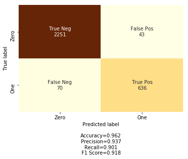
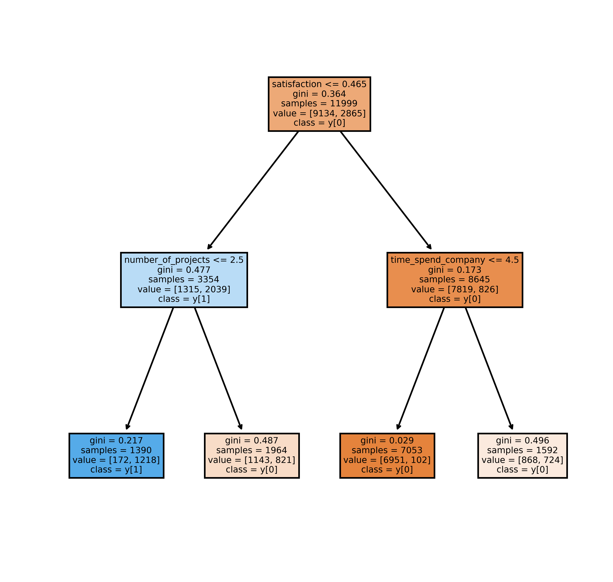

# previsao-rotatividade

Hoje em dia, o termo People Analytics tem ganhado cada vez mais popularidade. Em resumo, people analytics representa um conjunto de técnicas e métodos que são orientados a dados e focados em entender os processos, comportamentos e oportunidades das pessoas dentro das organizações, guiando os times de recursos humanos nas tomadas de decisões.

Vários times de RH podem se beneficiar desse tipo de análise. Algumas abordagens mais conhecidas são o apoio no processo de seleção de talentos, estudos de performance e remuneração, e a criação de times colaborativos.

Nesse post, vou mostrar um exemplo utilizando python de como os dados podem ajudar a prever a rotatividade dentro da organização. Esse modelo consegue prever quando um funcionário pretende sair da empresa e ajuda o time de atração e seleção a se preparar para que as cadeiras não fiquem vazias!

**Vamos começar?**

Aqui eu vou mostrar os principais comandos pra gerar os resultados, e mais detalhes do código podem ser vistos no arquivo Estudo-Rotatividade.ipynb. Como a ideia é que seja um estudo para iniciantes na área, vou evitar explicações complexas de teoria e programação.

Começamos então com a leitura da base e uma análise dos atributos que vamos utilizar pra construir o modelo :)

```
dados = pd.read_csv("turnover.csv")
dados.head()
```

A figura abaixo mostra as primeiras linhas da base (que contem informações de 15 mil funcionários diferentes). 


Essa tabela é composta de 10 colunas diferentes:

- satisfaction: um indicador que varia de 0 a 1 e mostra o quão satisfeito o funcionário esta na emprsa.
- evaluation: um indicador da ultima performance do funcionário (varia de 0 a 1).
- number_of_projects: o número de projetos que o funcionário já participou na empresa.
- average_montly_hours: o número médio de horas que o funcionario trabalha mensalmente.
- time_spend_company: o tempo de empresa do colaborador.
- work_accident: indica 0 se o colaborador nunca teve um acidente de trabalho, e 1 caso ele teve.
- promotion: se o funcionário foi promovido nos ultimos cinco anos (1 representa promoção)
- department: o departamento do funcionário na empresa.
- salary: o nível de salário do funcionário (baixo, médio, alto).
- churn: a coluna que indica se o funcionário saiu ou não da empresa.

Nosso objetivo aqui é construir um modelo que utilize as 9 primeiras para identificar padrões de comportamento e tentar prever se o funcionário saiu ou não da empresa (a coluna churn é utilizada para ensinar o modelo, e para validar sua performance).

**Análise simples dos dados**

A primeira análise que vamos fazer aqui é identificar se existe correlação entre as variáveis, ou seja, vamos checar se os resultados de algumas delas tem relação direta com outras. Para isso, construimos uma matriz de correção, gerada com o código abaixo.

```
matriz = np.triu(dados.corr())
sns.heatmap(dados.corr(), annot = True, cmap = 'YlOrBr', mask = matriz, cbar = False)
```

O resultado pode ser visto na figura a seguir. A correlação varia de -1 a 1, onde 1 indica um comportamento diretamente proporcional entre duas variáveis (exemplo: os valores de ambas as colunas crescem juntos), e -1 indica um comportamento inversamente proporcional (exemplo: enquanto o valor de uma coluna cresce, o outro descresce). Uma correlação de 0 indica que não há relação entre as duas variáveis.


Alguns insights que já podemos extrair daqui: a satisfação dos funcionarios possui alguma relação inversamente proporcional com o fato deles sairem ou não da empresa (-0.39), o número médio de horas de trabalho mensais esta relacionada com o número de projetos que o funcionário participa (0.42) com a sua avaliação (0.34), e a saída ou não dos funcionários também tem alguma relação com o tempo de empresa (0.14) e com a ocorrência ou não de acidentes (-0.15). 

Esses insights são importantes pra ajudar o time a definir algumas hipóteses e guiar os estudos que seguirão. De fato, nosso modelo vai poder nos dizer um pouco mais sobre a importância de cada um deles no resultado que estamos estudando.

Outro ponto interessante é avaliar o quanto da nossa amostra de fato saiu da empresa. O código abaixo nos ajuda a identificar essa porcentagem.

```
dados.churn.value_counts()/len(dados)*100
```

Como resultado, temos que 23.8% da nossa amostra saiu da empresa. No mundo dos dados, quanto mais balanceado tiver esse valor (50% da base saiu da empresa), melhor. Entretando, quando avaliamos o contexto desses dados, não podemos esperar que metade dos nossos funcionários decida sair da empresa, né?

**Variáveis categóricas**

Nesse exemplo, vou usar como modelo uma árvore de decisão, um modelo simples que nos ajuda a não só prever os resultados, mas também entender o porque de cada predição. Uma dificuldade que temos aqui, é que esse modelo aprende com colunas numéricas, e na nossa base temos duas colunas (salary e department) que são categóricas. Dessa forma, o próximo passo aqui é transformar essas variáveis em números.

Começamos com o salário, onde a solução é simples já que existe uma relação ordinal entre as possibilidades, ou seja, um salário high é maior do que um salário medium que é maior do que um salário low. Portanto, uma solução simples é transformar os salários low em 1, medium em 2, e high em 3. Conseguimos uma coluna numérica e que mantém a mesma interpretabilidade do que a coluna categórica. O código abaixo cuida disso pra gente.

```
salarios = {"salary":  {"low": 1, "medium": 2, "high": 3}}
dados.replace(salarios, inplace=True)
```

Entretanto, quando lidamos com o departamento, uma solução dessas não pode ser aplicada, porque se dissermos que o RH pode ser representado por 1, e a área de tecnologia por 2, o modelo pode entender que tecnologia > RH, quando essa relação não existe. Nesse caso, utilizamos as variaveis *dummies*. Nesse [link](https://medium.com/data-hackers/vari%C3%A1veis-dummy-o-que-%C3%A9-quando-usar-e-como-usar-78de66cfcca9) esta bem explicadinho como elas funcionam, mas em resumo, suponha uma variável sexo que pode ser Masculino ou Feminino (outra relação onde não podemos usar números), essa técnica cria duas variaveis novas (chamadas Masculino e outra Feminino), e quando temos um funcionário do sexo masculino, a coluna Masculino tera o valor 1 e a coluna Feminino tera o valor 0, e vice-versa. Portanto, no nosso estudo, vamos ter uma coluna pra cada departmamento, sendo que só uma delas terá o valor 1. O código abaixo cuida disso pra gente.

```
dados = dados.join(pd.get_dummies(dados.department))
dados.drop("department", axis = 1, inplace = True)
dados.drop("management", axis = 1, inplace = True)
```
**Criação do modelo**

Vamos pro modelo então?

A primeira coisa que temos que pensar, é que precisamos de alguma forma validar se o nosso modelo está decidindo com qualidade se o funcionário saiu ou não da empresa. Pra isso, precisamos de alguns dados para testarmos o modelo e checar se ele acerta. Um ponto de atenção quando vamos validar o nosso modelo, é que não podemos checar a eficiência dele em algum dado que ele usou pra aprender! É a mesma coisa que decorar um monte de respostas de perguntas e ir fazer uma prova. Podemos tirar 10, mas isso não garante que aprendemos alguma coisa.

A técnica mais utilizada pra lidar com isso, é separar a nossa amostra de dados em dois grupos: treino e teste. Os dados de treino vão ser utilizados para que o modelo aprenda quais são os padrões que podem ser generalizados pra decidir se o funcionário vai sair ou não da empresa, e os dados de teste (não vistos pelo modelo antes) são utilizados para checar se o modelo aprendeu bem. 

O código abaixo cumpre dois objetivos: divide a nossa tabela em duas (a tabela com todas as 9 variáveis que vão ser utilizadas para que o modelo identifique os padrões, e uma outra só com a coluna churn que queremos prever) e a seguir separa essas tabelas em um grupo de treino e um grupo de teste. Nesse caso, 80% dos funcionários estão no conjunto de treino e 20% no de teste.

Com isso feito, agora é só construir o modelo!

Nesse exemplo, como já mencionei, estou usando uma árvore de decisão. Detalhes sobre como ela funciona pode ser encontrado [aqui](https://medium.com/machine-learning-beyond-deep-learning/%C3%A1rvores-de-decis%C3%A3o-3f52f6420b69). No geral, ela identifica padrões nas variáveis e cria regras de negócio para poder classificar se um funcionário sairá ou não da empresa. Quando terminarmos de construir, eu mostro um exemplo visual que esclarece o funcionamento dela.

Muita gente se assusta com essa etapa de criação do modelo, mas ela é bem simples, é só executar esse código abaixo.

```
arvore_decisao = DecisionTreeClassifier(max_depth = 4, random_state = 42, min_samples_leaf = 100)
```

*Obs: não vou entrar em detalhes do porque dos parâmetros max_depth e min_samples_leaf para não deixar o post complexo, mas a ideia é que essas "caracteristicas" da árvore façam com que ela gere melhores resultados, nesse caso.*

Com a árvore construida, a gente só precisa passar os dados de treino pra ela (as 9 features e qual o impacto da combinação delas na vida do funcionário) e ela encontra os padrões sozinha! A ideia dessa função *fit* é que ela adapta a árvore para representar o conjunto de dados que esta recebendo.

```
arvore_decisao.fit(dados_treino, resposta_treino)
```

Pronto! a árvore esta criada, já aprendeu os padrões e daqui em diante é só melhorar ela até que esteja do jeito que queremos pra ser aplicada. Vou finalizar esse post mostrando os resultados que conseguimos com ela.

**Avaliação**

O código abaixo utiliza a árvore que construimos para prever se os funcionários que estão no conjunto de teste sairão ou não da empresa. A imagem a seguir sumariza os principais resultados.

```
predicao_teste = arvore_decisao.predict(dados_teste)
labels = ['True Neg','False Pos','False Neg','True Pos']
categories = ['Zero', 'One']
make_confusion_matrix(confusion_matrix(resposta_teste, predicao_teste), group_names=labels, categories=categories, cmap='YlOrBr', cbar = False, percent = False)
```



Vou tentar resumir essa imagem sem complicar muito. Na vertical, nós temos a informação real daqueles funcionários (Zero = eles não sairam da empresa, One = eles sairam da empresa). Na horizontal, temos a predição que a nossa árvore gerou (Zero = o funcionário não vai sair da empresa, One = ele vai sair da empresa). Portanto, no primeiro quadrante da matriz nós temos os True Negatives, isto é, o número de pessoas que a nossa arvore disse que não ia sair da empresa e que de fato não sairam. No ultimo quadrante, temos os True Positives, ou seja, o número de pessoas que a nossa árvore disse que iria sair e que de fato sairam. Os false positives e false negatives são aqueles em que nossa árvore disse que fariam uma coisa, mas na realidade fizeram outra.

Logo abaixo, temos algumas métricas que resumem esses resultados. Vou explicar aqui a *accuracy, precision e recall*. 

- Accuracy: representa o número de acertos totais da nossa árvore. Nesse caso, indica que ela acertou a resposta de 96% dos funcionários dos dados de teste. Entretanto, quando lidamos com dados desbalanceados, essa métrica não é recomendada pois menospreza a classe com menos amostras.
- Precision: essa métrica é mais interessante quando temos classes desbalanceadas. Para entender ela, é só fazer a seguinte pergunta: Dentre todos aqueles que a minha árvore disse que iria sair, quantos sairam? Dentre todos aqueles que a minha árvore disse que não iria sair, quantos não sairam? A média dessas duas respostas é a nossa precisão (93.7%). Notamos que aqui damos um "peso igual" para ambas as classes e podemos ter resultados mais representativos.
- Recall: possui certa similaridade com a precisão em entendimento. Para ela, fazemos as perguntas: Dentre todos aqueles que nós sabemos que sairam da empresa, quantos a nossa árvore acertou? Dentre todos aqueles que nós sabemos que não sairam da empres, quantos a nossa árvore acertou? A média disso é o nosso recall.

O uso das métricas certas é muito importante pra avaliar nossos modelos. Quando reportamos os resultados com as métricas erradas, podemos disseminar uma falsa eficiência dentro da nossa empresa.

Na figura abaixo, eu mostro um "corte" da árvore gerada nesse nosso modelo. Essa é a vantagem de usar uma árvore! além do resultado, ainda podemos entender como eles foram obtidos!



O entendimento aqui é simples, o SIM é sempre pra direita e o NÃO é sempre pra esquerda. No quadro superior, temos a pergunta: satisfaction <= 0.465? Se a resposta for não, descemos para o quadro azul claro onde a pergunta é number_of_projects <= 2.5 ? Se a resposta for não, chegamos no nó final onde a class = [1]. O racional que construimos é o seguinte: se a satisfação do funcionário for menor que 0.465 e o número médio de projetos dele for 2.5, ele provavelmente vai deixar a empresa (class y[1])!

Bom! Se você chegou aqui.. nesse post era isso o que eu queria mostrar! Não me aprofundei em nenhum conceito porque o objetivo era mostrar como a aplicação pode ser util para tomar decisões dentro do RH nas organizações. 

Meu objetivo é fazer mais posts iguais a este, mostrando outras aplicações e detalhando algumas dessas técnicas.

Valeu pela atenção, e espero que tenha curtido ;)
Qualquer dúvida, meu email é *brunosena4@gmail.com*

*Referências: os dados utilizados nesse estudo são públicos, e tanto o dataset quanto a inspiração para o estudo vieram de um curso chamado: Human Resources Analytics: Predicting Employee Churn in Python, disponível nesse [link](https://learn.datacamp.com/)
